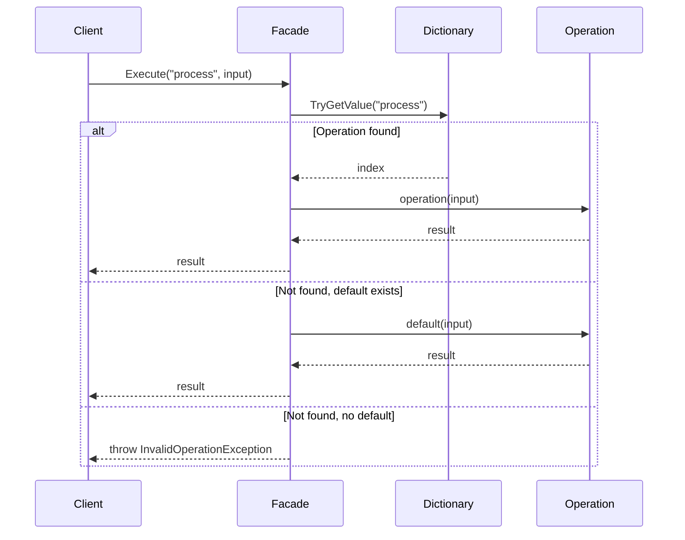
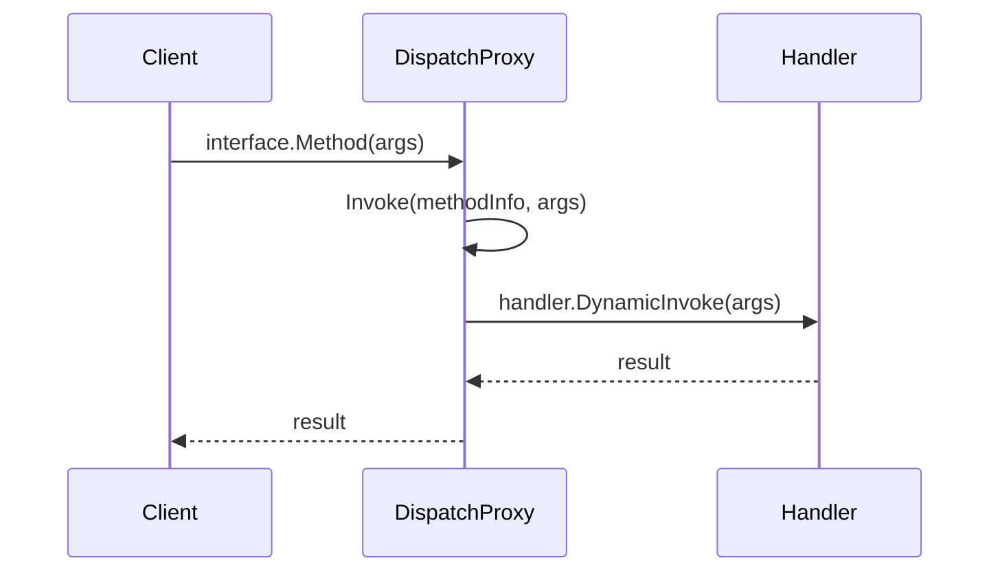

# Facade Pattern API Reference

Complete API documentation for the Facade pattern in PatternKit.

## Namespace

```csharp
using PatternKit.Structural.Facade;
```

---

## Facade\<TIn, TOut\>

Fluent facade providing named operations that coordinate subsystem interactions.

```csharp
public sealed class Facade<TIn, TOut>
```

### Type Parameters

| Parameter | Description |
|-----------|-------------|
| `TIn` | Input type for operations |
| `TOut` | Output type produced by operations |

### Delegates

```csharp
public delegate TOut Operation(in TIn input);
```

| Delegate | Description |
|----------|-------------|
| `Operation` | Coordinates subsystem calls and returns a result |

### Static Methods

| Method | Returns | Description |
|--------|---------|-------------|
| `Create()` | `Builder` | Create a new builder |

### Instance Methods

| Method | Returns | Description |
|--------|---------|-------------|
| `Execute(string operationName, in TIn input)` | `TOut` | Execute named operation |
| `TryExecute(string operationName, in TIn input, out TOut output)` | `bool` | Try to execute operation |
| `HasOperation(string operationName)` | `bool` | Check if operation exists |

### Example

```csharp
var facade = Facade<int, string>.Create()
    .Operation("double", (in int x) => (x * 2).ToString())
    .Operation("square", (in int x) => (x * x).ToString())
    .Default((in int x) => "Unknown operation")
    .Build();

var result = facade.Execute("double", 5); // "10"

if (facade.TryExecute("triple", 5, out var output))
    Console.WriteLine(output);
```

---

## Facade\<TIn, TOut\>.Builder

Builder for configuring facade operations.

```csharp
public sealed class Builder
```

### Methods

| Method | Returns | Description |
|--------|---------|-------------|
| `Operation(string name, Operation handler)` | `Builder` | Register case-sensitive operation |
| `OperationIgnoreCase(string name, Operation handler)` | `Builder` | Register case-insensitive operation |
| `Default(Operation handler)` | `Builder` | Configure fallback operation |
| `Build()` | `Facade<TIn, TOut>` | Build immutable facade |

### Exceptions

| Method | Exception | Condition |
|--------|-----------|-----------|
| `Operation` | `ArgumentException` | Operation name already registered |
| `OperationIgnoreCase` | `InvalidOperationException` | Mixing case-sensitive and case-insensitive |
| `Build` | `InvalidOperationException` | No operations and no default configured |

### Semantics

- **Case sensitivity**: `Operation` is case-sensitive, `OperationIgnoreCase` is case-insensitive
- **Cannot mix**: All operations must use the same case sensitivity
- **Last default wins**: Multiple `Default` calls replace previous
- **At least one required**: Either an operation or default must be configured

---

## TypedFacade\<TFacadeInterface\>

Compile-time safe facade using interface contracts.

```csharp
public static class TypedFacade<TFacadeInterface>
    where TFacadeInterface : class
```

### Type Parameters

| Parameter | Description |
|-----------|-------------|
| `TFacadeInterface` | Interface defining facade operations (must be an interface) |

### Static Methods

| Method | Returns | Description |
|--------|---------|-------------|
| `Create()` | `Builder` | Create a new builder |

### Example

```csharp
public interface IOrderService
{
    OrderResult Process(OrderRequest request);
    bool Cancel(int orderId);
}

var service = TypedFacade<IOrderService>.Create()
    .Map(x => x.Process, (OrderRequest req) => ProcessOrder(req))
    .Map(x => x.Cancel, (int id) => CancelOrder(id))
    .Build();

var result = service.Process(request); // Type-safe call
```

---

## TypedFacade\<TFacadeInterface\>.Builder

Builder for mapping interface methods to implementations.

```csharp
public sealed class Builder
```

### Methods

| Method | Returns | Description |
|--------|---------|-------------|
| `Map<TResult>(selector, handler)` | `Builder` | Map zero-parameter method |
| `Map<T1, TResult>(selector, handler)` | `Builder` | Map one-parameter method |
| `Map<T1, T2, TResult>(selector, handler)` | `Builder` | Map two-parameter method |
| `Map<T1, T2, T3, TResult>(selector, handler)` | `Builder` | Map three-parameter method |
| `Map<T1, T2, T3, T4, TResult>(selector, handler)` | `Builder` | Map four-parameter method |
| `Build()` | `TFacadeInterface` | Build facade implementing interface |

### Method Signatures

```csharp
// Zero parameters
public Builder Map<TResult>(
    Expression<Func<TFacadeInterface, Func<TResult>>> methodSelector,
    Func<TResult> handler)

// One parameter
public Builder Map<T1, TResult>(
    Expression<Func<TFacadeInterface, Func<T1, TResult>>> methodSelector,
    Func<T1, TResult> handler)

// Two parameters
public Builder Map<T1, T2, TResult>(
    Expression<Func<TFacadeInterface, Func<T1, T2, TResult>>> methodSelector,
    Func<T1, T2, TResult> handler)

// Up to four parameters supported
```

### Exceptions

| Method | Exception | Condition |
|--------|-----------|-----------|
| `Create()` | `InvalidOperationException` | Type parameter is not an interface |
| `Map` | `ArgumentException` | Method already mapped |
| `Map` | `ArgumentException` | Return type or parameter types mismatch |
| `Build` | `InvalidOperationException` | Not all interface methods mapped |

### Example

```csharp
public interface ICalculator
{
    int Add(int a, int b);
    int Multiply(int a, int b);
    int Negate(int x);
    int Zero();
}

var calc = TypedFacade<ICalculator>.Create()
    .Map(x => x.Add, (int a, int b) => a + b)
    .Map(x => x.Multiply, (int a, int b) => a * b)
    .Map(x => x.Negate, (int x) => -x)
    .Map(x => x.Zero, () => 0)
    .Build();

calc.Add(5, 3);      // 8
calc.Multiply(4, 2); // 8
calc.Negate(5);      // -5
calc.Zero();         // 0
```

---

## Execution Flow

### Operation Lookup



### TypedFacade Dispatch



---

## Thread Safety

| Component | Thread-Safe |
|-----------|-------------|
| `Builder` | No - single-threaded configuration |
| `Facade<TIn, TOut>` | Yes - immutable after build |
| `TypedFacade` proxy | Yes - immutable after build |
| `Execute` | Yes - but operation logic may not be |

### Implementation Notes

- Operations stored in dictionary + array for O(1) lookup
- Dictionary frozen at Build() time
- `in TIn` parameters avoid struct copies
- No reflection in string-based facade execution path
- TypedFacade uses DispatchProxy (requires .NET Standard 2.1+)

---

## Comparison with Other Patterns

| Pattern | When to Use |
|---------|-------------|
| **Facade** | Simplify complex subsystem with named operations |
| **Adapter** | Convert one interface to another |
| **Decorator** | Add behavior without modifying components |
| **Proxy** | Control access to objects |

## See Also

- [Overview](index.md)
- [Comprehensive Guide](guide.md)
- [Real-World Examples](real-world-examples.md)
