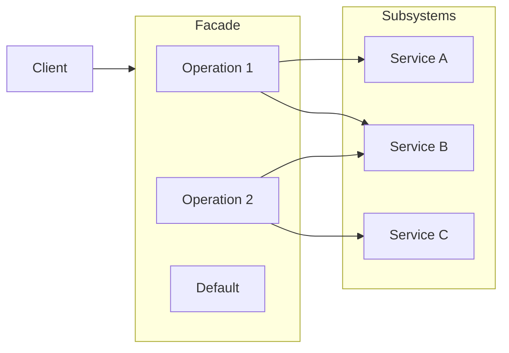

# Facade Pattern Guide

Comprehensive guide to using the Facade pattern in PatternKit.

## Overview

Facade provides a simplified, unified interface to a complex subsystem or set of interfaces. PatternKit's implementation offers a fluent, allocation-light way to coordinate multiple subsystem calls behind named operations.



## Getting Started

### Installation

```csharp
using PatternKit.Structural.Facade;
```

### Basic Usage

```csharp
// Create a facade with named operations
var calc = Facade<(int a, int b), int>.Create()
    .Operation("add", (in (int a, int b) input) => input.a + input.b)
    .Operation("multiply", (in (int a, int b) input) => input.a * input.b)
    .Build();

var sum = calc.Execute("add", (5, 3));        // 8
var product = calc.Execute("multiply", (5, 3)); // 15
```

## Core Concepts

### The Operation Delegate

The `Operation` delegate coordinates subsystem interactions:

```csharp
public delegate TOut Operation(in TIn input);
```

Operations receive input by `in` reference to avoid struct copies and return a single result type.

### Named Operations

Register operations with unique names:

```csharp
var facade = Facade<string, string>.Create()
    .Operation("status", (in string _) => "System operational")
    .Operation("version", (in string _) => "v2.1.0")
    .Build();
```

Operation names are **case-sensitive** by default.

### Case-Insensitive Operations

For case-insensitive matching, use `OperationIgnoreCase`:

```csharp
var facade = Facade<string, string>.Create()
    .OperationIgnoreCase("Hello", (in string name) => $"Hello, {name}!")
    .OperationIgnoreCase("Goodbye", (in string name) => $"Goodbye, {name}!")
    .Build();

facade.Execute("hello", "Alice");   // "Hello, Alice!"
facade.Execute("HELLO", "Bob");     // "Hello, Bob!"
```

**Note**: Cannot mix case-sensitive and case-insensitive operations in the same facade.

### Default Operation

Configure a fallback for unknown operation names:

```csharp
var facade = Facade<string, string>.Create()
    .Operation("known", (in string x) => $"Result: {x}")
    .Default((in string x) => "Operation not found")
    .Build();

facade.Execute("known", "test");   // "Result: test"
facade.Execute("unknown", "test"); // "Operation not found"
```

### Safe Execution

Use `TryExecute` for non-throwing operation attempts:

```csharp
if (facade.TryExecute("process", orderData, out var result))
{
    Console.WriteLine($"Success: {result}");
}
else
{
    Console.WriteLine("Operation not found");
}
```

## TypedFacade (Compile-Time Safe)

For compile-time safety and IntelliSense support, use `TypedFacade`:

### Define Interface

```csharp
public interface ICalculator
{
    int Add(int a, int b);
    int Multiply(int a, int b);
    int Square(int x);
}
```

### Build Facade

```csharp
var calc = TypedFacade<ICalculator>.Create()
    .Map(x => x.Add, (int a, int b) => a + b)
    .Map(x => x.Multiply, (int a, int b) => a * b)
    .Map(x => x.Square, (int x) => x * x)
    .Build();

// Type-safe invocation
var sum = calc.Add(5, 3);      // 8
var square = calc.Square(4);    // 16
```

### Advantages of TypedFacade

| Feature | String-Based | TypedFacade |
|---------|-------------|-------------|
| Typo detection | Runtime | Compile time |
| IntelliSense | No | Yes |
| Refactoring | Manual | Automatic |
| Parameter types | Runtime checked | Compile-time |

## Common Patterns

### E-Commerce Order Facade

```csharp
public class OrderFacade
{
    private readonly IInventoryService _inventory;
    private readonly IPaymentService _payment;
    private readonly IShippingService _shipping;
    private readonly INotificationService _notification;

    private readonly Facade<OrderRequest, OrderResult> _facade;

    public OrderFacade(
        IInventoryService inventory,
        IPaymentService payment,
        IShippingService shipping,
        INotificationService notification)
    {
        _inventory = inventory;
        _payment = payment;
        _shipping = shipping;
        _notification = notification;

        _facade = Facade<OrderRequest, OrderResult>.Create()
            .Operation("process", ProcessOrder)
            .Operation("cancel", CancelOrder)
            .Operation("refund", RefundOrder)
            .Default((in OrderRequest _) =>
                new OrderResult { Status = "Unknown operation" })
            .Build();
    }

    public OrderResult Execute(string operation, OrderRequest request)
        => _facade.Execute(operation, request);

    private OrderResult ProcessOrder(in OrderRequest req)
    {
        var reserved = _inventory.Reserve(req.Items);
        var payment = _payment.Charge(req.PaymentMethod, req.Total);
        var shipment = _shipping.Schedule(req.Address, req.Items);
        _notification.SendConfirmation(req.CustomerId, shipment);

        return new OrderResult
        {
            Status = "Processed",
            TransactionId = payment,
            ShipmentId = shipment
        };
    }

    private OrderResult CancelOrder(in OrderRequest req)
    {
        _inventory.Release(req.OrderId);
        _payment.Void(req.OrderId);
        _shipping.Cancel(req.OrderId);
        _notification.SendCancellation(req.CustomerId);

        return new OrderResult { Status = "Cancelled" };
    }

    private OrderResult RefundOrder(in OrderRequest req)
    {
        _shipping.InitiateReturn(req.OrderId);
        _payment.Refund(req.OrderId);
        _inventory.Restock(req.Items);
        _notification.SendRefundConfirmation(req.CustomerId);

        return new OrderResult { Status = "Refunded" };
    }
}
```

### Microservices Coordination

```csharp
var checkoutFacade = Facade<CheckoutRequest, CheckoutResult>.Create()
    .Operation("checkout", (in CheckoutRequest req) =>
    {
        var cartItems = cartService.GetItems(req.CartId);
        var prices = pricingService.Calculate(cartItems);
        var tax = taxService.CalculateTax(prices, req.ShippingAddress);
        var payment = paymentService.Process(req.PaymentInfo, prices.Total + tax.Amount);
        var order = orderService.Create(cartItems, payment);

        return new CheckoutResult
        {
            OrderId = order.Id,
            Total = prices.Total + tax.Amount
        };
    })
    .Build();
```

### Legacy System Integration

```csharp
var legacyFacade = Facade<LegacyRequest, ModernResponse>.Create()
    .Operation("migrate", (in LegacyRequest req) =>
    {
        // Hide legacy complexity
        var data = legacySystem.GetData(req.Id);
        var transformed = transformer.Convert(data);
        var validated = validator.Validate(transformed);
        return new ModernResponse(validated);
    })
    .Build();
```

### Command Dispatcher Alternative

```csharp
var commandFacade = Facade<Command, CommandResult>.Create()
    .Operation("create-user", CreateUserHandler)
    .Operation("delete-user", DeleteUserHandler)
    .Operation("update-user", UpdateUserHandler)
    .Default((in Command cmd) =>
        new CommandResult { Success = false, Error = "Unknown command" })
    .Build();

var result = commandFacade.Execute(command.Type, command);
```

## Error Handling

### Wrap Operations with Try-Catch

```csharp
var robustFacade = Facade<Request, Result>.Create()
    .Operation("process", (in Request req) =>
    {
        try
        {
            var step1 = service1.Process(req);
            var step2 = service2.Process(step1);
            return new Result { Success = true, Data = step2 };
        }
        catch (Exception ex)
        {
            logger.LogError(ex, "Process failed");
            return new Result { Success = false, Error = ex.Message };
        }
    })
    .Build();
```

### Check Operation Existence

```csharp
if (facade.HasOperation("process"))
{
    var result = facade.Execute("process", data);
}
else
{
    // Handle missing operation
}
```

## Async Coordination

For async operations, wrap Task in the output type:

```csharp
var asyncFacade = Facade<string, Task<string>>.Create()
    .Operation("fetch", async (in string url) =>
    {
        if (cache.TryGet(url, out var cached))
            return cached;

        var content = await httpClient.GetStringAsync(url);
        await cache.SetAsync(url, content);
        return content;
    })
    .Build();

var content = await facade.Execute("fetch", url);
```

## Best Practices

### Do

- **Use facades to simplify complex subsystems**
- **Group related operations** in a single facade
- **Make operations stateless** (capture services in closures)
- **Use descriptive operation names**
- **Provide default operations** for better error handling

### Don't

- **Don't use facades for simple 1-to-1 mappings** (use direct calls)
- **Don't mix unrelated operations** in one facade
- **Don't make operations stateful** (facades should be reusable)
- **Don't use as a god object** (keep facades focused)

## Thread Safety

| Component | Thread-Safe |
|-----------|-------------|
| `Builder` | No - single-threaded configuration |
| `Facade<TIn, TOut>` | Yes - immutable after build |
| `Execute` | Yes - but operation logic may not be |

## Performance Characteristics

- **Allocation-light**: Uses arrays internally, minimal allocations after build
- **O(1) operation lookup**: Dictionary-based resolution
- **Zero boxing**: Uses `in` parameters for readonly references
- **Build once, use many**: Facade is immutable and reusable

## See Also

- [Overview](index.md)
- [API Reference](api-reference.md)
- [Real-World Examples](real-world-examples.md)
