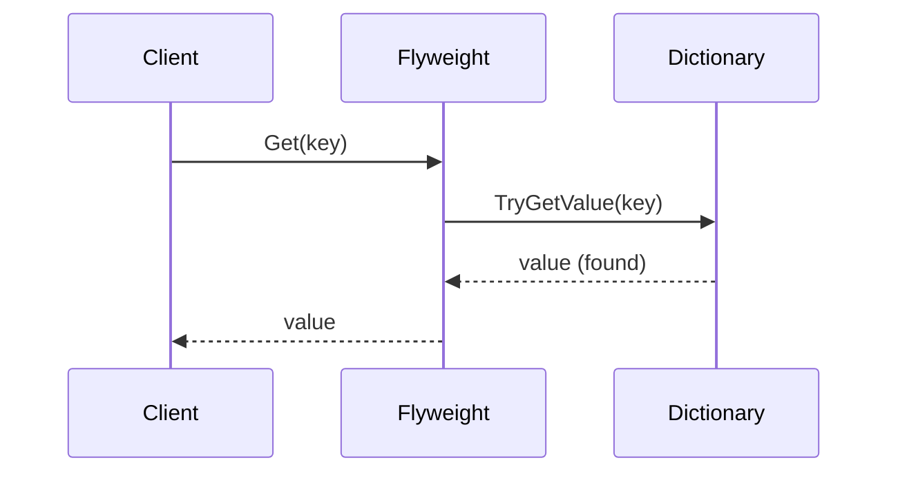
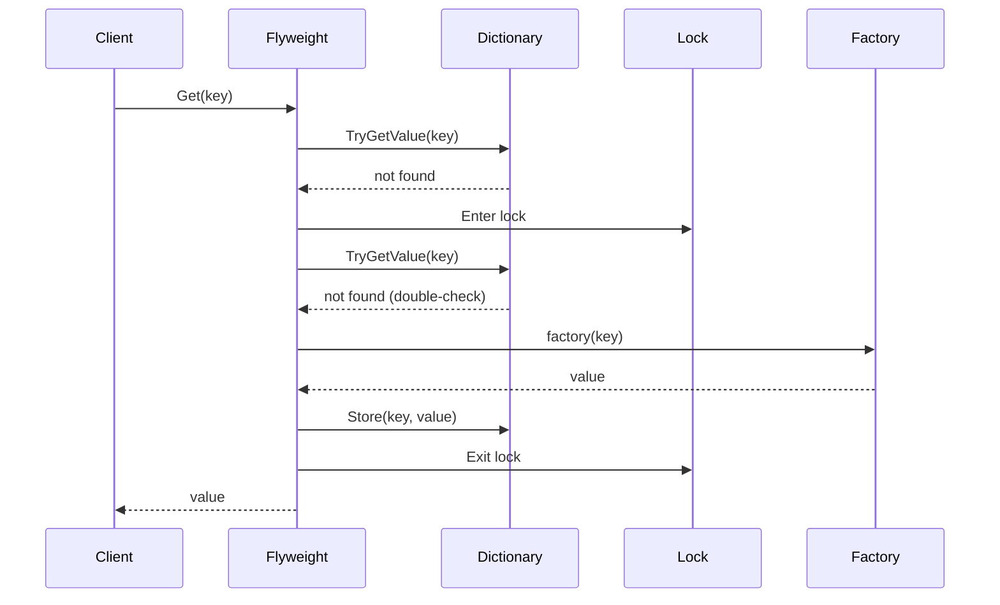

# Flyweight Pattern API Reference

Complete API documentation for the Flyweight pattern in PatternKit.

## Namespace

```csharp
using PatternKit.Structural.Flyweight;
```

---

## Flyweight\<TKey, TValue\>

Allocation-light, thread-safe flyweight cache that shares immutable objects by key.

```csharp
public sealed class Flyweight<TKey, TValue> where TKey : notnull
```

### Type Parameters

| Parameter | Constraint | Description |
|-----------|------------|-------------|
| `TKey` | `notnull` | Key type identifying intrinsic state (must have stable equality) |
| `TValue` | none | Value type to be shared (should be immutable) |

### Delegates

```csharp
public delegate TValue Factory(TKey key);
```

| Delegate | Description |
|----------|-------------|
| `Factory` | Creates intrinsic value for key on first request |

### Static Methods

| Method | Returns | Description |
|--------|---------|-------------|
| `Create()` | `Builder` | Create a new builder |

### Instance Methods

| Method | Returns | Description |
|--------|---------|-------------|
| `Get(in TKey key)` | `TValue` | Get or lazily create value for key |
| `TryGetExisting(in TKey key, out TValue value)` | `bool` | Query without creating |
| `Snapshot()` | `IReadOnlyDictionary<TKey, TValue>` | Point-in-time copy |

### Instance Properties

| Property | Type | Description |
|----------|------|-------------|
| `Count` | `int` | Number of cached entries |

### Example

```csharp
var glyphs = Flyweight<char, Glyph>.Create()
    .Preload(' ', new Glyph(' ', 3))
    .WithFactory(c => new Glyph(c, MeasureWidth(c)))
    .WithCapacity(128)
    .Build();

var gA = glyphs.Get('A');            // Creates on first call
var gA2 = glyphs.Get('A');           // Returns cached
Debug.Assert(ReferenceEquals(gA, gA2)); // Same instance

if (glyphs.TryGetExisting('Z', out var z))
    Console.WriteLine($"Z cached: {z.Width}");
else
    Console.WriteLine("Z not yet created");

Console.WriteLine($"Total cached: {glyphs.Count}");
```

---

## Flyweight\<TKey, TValue\>.Builder

Builder for configuring flyweight cache.

```csharp
public sealed class Builder
```

### Methods

| Method | Returns | Required | Description |
|--------|---------|----------|-------------|
| `WithFactory(Factory factory)` | `Builder` | Yes | Set factory for creating values |
| `WithCapacity(int capacity)` | `Builder` | No | Set initial dictionary capacity |
| `WithComparer(IEqualityComparer<TKey> comparer)` | `Builder` | No | Set custom key comparer |
| `Preload(TKey key, TValue value)` | `Builder` | No | Preload single entry |
| `Preload(params (TKey, TValue)[] items)` | `Builder` | No | Preload multiple entries |
| `Build()` | `Flyweight<TKey, TValue>` | Yes | Build immutable cache |

### Exceptions

| Method | Exception | Condition |
|--------|-----------|-----------|
| `WithFactory` | `ArgumentNullException` | Factory is null |
| `WithCapacity` | `ArgumentOutOfRangeException` | Capacity is negative |
| `WithComparer` | `ArgumentNullException` | Comparer is null |
| `Build` | `InvalidOperationException` | No factory configured |

### Semantics

- **Factory required**: Must call `WithFactory` before `Build`
- **Preload**: Last value wins for duplicate keys
- **Capacity auto-sizing**: If not set, scales to preload count
- **Builder not thread-safe**: Configure on single thread, then share flyweight

---

## Get Method

```csharp
public TValue Get(in TKey key)
```

Retrieves or lazily creates the shared value for a key.

### Parameters

| Parameter | Description |
|-----------|-------------|
| `key` | Lookup key (passed by `in` to avoid copies) |

### Returns

Cached shared instance for the key.

### Behavior

1. **Fast path**: Dictionary lookup without lock
2. **Slow path** (miss): Lock → double-check → factory → store → return

### Exceptions

| Exception | Condition |
|-----------|-----------|
| `InvalidOperationException` | Factory returned null |

### Thread Safety

Thread-safe. Factory invoked exactly once per key under lock.

```csharp
// Safe for concurrent access
Parallel.For(0, 1000, i =>
{
    var glyph = glyphs.Get((char)('A' + (i % 26)));
});
```

---

## TryGetExisting Method

```csharp
public bool TryGetExisting(in TKey key, out TValue value)
```

Queries for existing value without triggering creation.

### Parameters

| Parameter | Description |
|-----------|-------------|
| `key` | Lookup key |
| `value` | Output parameter for cached value |

### Returns

`true` if key exists in cache; `false` otherwise.

### Use Cases

- Check if value is cached before expensive operation
- Diagnostics and monitoring
- Conditional logic based on cache state

```csharp
if (!flyweight.TryGetExisting(key, out _))
{
    logger.Log($"Key {key} not cached, will be created on next Get");
}
```

---

## Snapshot Method

```csharp
public IReadOnlyDictionary<TKey, TValue> Snapshot()
```

Creates a point-in-time copy of cached entries.

### Returns

New dictionary containing all current key-value pairs.

### Performance

O(n) - allocates new dictionary. Use sparingly.

### Thread Safety

Thread-safe. Takes lock during copy to ensure consistency.

```csharp
// Diagnostic snapshot
var snapshot = flyweight.Snapshot();
foreach (var (key, value) in snapshot)
{
    Console.WriteLine($"{key}: {value}");
}
```

---

## Execution Flow

### Get (Cache Hit)



### Get (Cache Miss)



---

## Thread Safety

| Component | Thread-Safe |
|-----------|-------------|
| `Builder` | No - single-threaded configuration |
| `Flyweight<TKey, TValue>` | Yes - thread-safe after build |
| `Get` (hit) | Yes - lock-free |
| `Get` (miss) | Yes - single factory call per key |
| `TryGetExisting` | Yes - lock-free |
| `Snapshot` | Yes - takes lock for consistency |

### Implementation Notes

- Uses double-checked locking for lazy creation
- Dictionary mutated only during factory execution (under lock)
- Read path is lock-free after initial creation
- Values retained indefinitely (no eviction)

---

## Performance Characteristics

| Operation | Complexity | Allocations |
|-----------|------------|-------------|
| `Get` (hit) | O(1) | 0 |
| `Get` (miss) | O(1) + factory | 1 (value) |
| `TryGetExisting` | O(1) | 0 |
| `Count` | O(1) | 0 |
| `Snapshot` | O(n) | 1 (dictionary copy) |

### Memory

- Fixed overhead: 1 flyweight + 1 dictionary
- Per-key overhead: Dictionary entry + value
- No per-call allocations after warmup

---

## Complete Example

```csharp
using PatternKit.Structural.Flyweight;

public sealed record Glyph(char Char, int Width);

public class GlyphCache
{
    private readonly Flyweight<char, Glyph> _cache;

    public GlyphCache()
    {
        _cache = Flyweight<char, Glyph>.Create()
            .Preload(' ', new Glyph(' ', 3))
            .Preload(
                ('A', new Glyph('A', 8)),
                ('E', new Glyph('E', 7)),
                ('I', new Glyph('I', 4)),
                ('O', new Glyph('O', 9)),
                ('U', new Glyph('U', 8)))
            .WithCapacity(128)
            .WithFactory(c => new Glyph(c, MeasureWidth(c)))
            .Build();
    }

    public Glyph Get(char c) => _cache.Get(c);

    public int CalculateWidth(string text)
        => text.Sum(c => _cache.Get(c).Width);

    public void PrintDiagnostics()
    {
        Console.WriteLine($"Cached glyphs: {_cache.Count}");
        foreach (var (ch, glyph) in _cache.Snapshot())
        {
            Console.WriteLine($"  '{ch}': Width={glyph.Width}");
        }
    }

    private static int MeasureWidth(char c) => c switch
    {
        >= 'A' and <= 'Z' => c is 'W' or 'M' ? 10 : c is 'I' ? 4 : 7,
        >= 'a' and <= 'z' => c is 'w' or 'm' ? 8 : c is 'i' or 'l' ? 3 : 5,
        >= '0' and <= '9' => 6,
        _ => 4
    };
}

// Usage
var cache = new GlyphCache();

// Render text
string text = "Hello World!";
int totalWidth = cache.CalculateWidth(text);
Console.WriteLine($"Text width: {totalWidth}");

// Each unique character is allocated once
// "Hello World!" uses 8 unique glyphs (H,e,l,o, ,W,r,d,!)
cache.PrintDiagnostics();
```

---

## Comparison with Other Patterns

| Pattern | When to Use |
|---------|-------------|
| **Flyweight** | Share heavy, immutable state by key |
| **Singleton** | Single instance of a service |
| **Prototype** | Clone and customize objects |
| **Proxy** | Control access with caching behavior |

## See Also

- [Overview](index.md)
- [Comprehensive Guide](guide.md)
- [Real-World Examples](real-world-examples.md)
