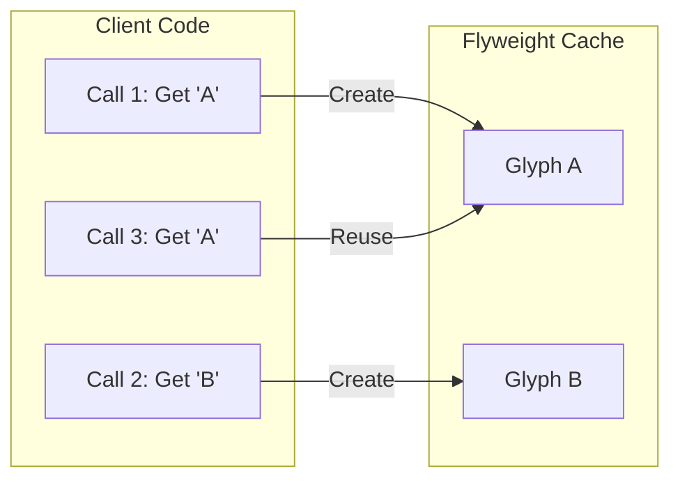

# Flyweight Pattern Guide

Comprehensive guide to using the Flyweight pattern in PatternKit.

## Overview

Flyweight minimizes memory usage by sharing common state among many objects. PatternKit's implementation provides a fluent, allocation-light, thread-safe cache that shares immutable (intrinsic) state by key, while extrinsic state is supplied at use time.



## Getting Started

### Installation

```csharp
using PatternKit.Structural.Flyweight;
```

### Basic Usage

```csharp
// Create a flyweight cache for glyphs
var glyphs = Flyweight<char, Glyph>.Create()
    .WithFactory(c => new Glyph(c, MeasureWidth(c)))
    .Build();

// Get shared instances
var gA1 = glyphs.Get('A');
var gA2 = glyphs.Get('A');

// Same instance - no duplicate allocation
Debug.Assert(ReferenceEquals(gA1, gA2));
```

## Core Concepts

### Intrinsic vs Extrinsic State

| State Type | Description | Storage | Example |
|------------|-------------|---------|---------|
| **Intrinsic** | Shared, immutable, heavy | In flyweight cache | Glyph shape, style definition |
| **Extrinsic** | Context-specific, lightweight | Passed at use time | X/Y position, color tint |

```csharp
// Intrinsic: Glyph shape data (shared)
var glyph = glyphs.Get('A');

// Extrinsic: Position and color (per use)
RenderGlyph(glyph, x: 100, y: 50, color: Colors.Red);
```

### The Factory Delegate

The `Factory` delegate creates intrinsic values on first request:

```csharp
public delegate TValue Factory(TKey key);
```

Factories must:
- Return non-null values (throws if null returned)
- Be pure (no side effects)
- Be fast (called during cache miss, under lock)

```csharp
var styles = Flyweight<string, Style>.Create()
    .WithFactory(name => ParseStyleDefinition(name))
    .Build();
```

### Preloading Hot Keys

Pre-populate frequently-used entries to avoid first-call latency:

```csharp
var glyphs = Flyweight<char, Glyph>.Create()
    .Preload(' ', new Glyph(' ', 3))  // Space - very common
    .Preload('\n', new Glyph('\n', 0)) // Newline
    .Preload(
        ('A', new Glyph('A', 8)),
        ('E', new Glyph('E', 7)),
        ('T', new Glyph('T', 7)))
    .WithFactory(c => new Glyph(c, MeasureWidth(c)))
    .Build();
```

### Custom Comparers

Use custom equality comparers for case-insensitive or specialized key matching:

```csharp
var styles = Flyweight<string, Style>.Create()
    .WithComparer(StringComparer.OrdinalIgnoreCase)
    .WithFactory(name => new Style(name.ToUpperInvariant()))
    .Build();

var a = styles.Get("header");
var b = styles.Get("HEADER");
Debug.Assert(ReferenceEquals(a, b)); // Same instance
```

### Capacity Hints

Set initial capacity to reduce rehashing:

```csharp
var glyphs = Flyweight<char, Glyph>.Create()
    .WithCapacity(128)  // Expecting ~128 unique characters
    .WithFactory(c => new Glyph(c, MeasureWidth(c)))
    .Build();
```

## Common Patterns

### Text Rendering (Glyph Cache)

```csharp
public sealed record Glyph(char Char, int Width, int[] PixelData);

public class TextRenderer
{
    private readonly Flyweight<char, Glyph> _glyphs;

    public TextRenderer(Font font)
    {
        _glyphs = Flyweight<char, Glyph>.Create()
            .Preload(' ', new Glyph(' ', font.SpaceWidth, Array.Empty<int>()))
            .WithCapacity(128)
            .WithFactory(c => new Glyph(c, font.MeasureChar(c), font.RasterizeChar(c)))
            .Build();
    }

    public void Render(string text, int startX, int startY)
    {
        int x = startX;
        foreach (var ch in text)
        {
            var glyph = _glyphs.Get(ch);  // Intrinsic: glyph data
            DrawGlyph(glyph, x, startY);   // Extrinsic: position
            x += glyph.Width;
        }
    }
}

// Layout calculation
int CalculateWidth(string text)
{
    return text.Sum(ch => _glyphs.Get(ch).Width);
}

// 120,000 character document uses ~85 unique Glyph objects
// instead of 120,000 separate allocations
```

### UI Style/Theme Cache

```csharp
public sealed record Style(
    string FontFamily,
    int FontSize,
    string ForegroundColor,
    bool IsBold,
    bool IsItalic);

var styles = Flyweight<string, Style>.Create()
    .WithComparer(StringComparer.OrdinalIgnoreCase)
    .Preload(
        ("default", new Style("Arial", 12, "#000", false, false)),
        ("heading", new Style("Arial", 18, "#333", true, false)),
        ("code", new Style("Consolas", 11, "#1a1a1a", false, false)))
    .WithFactory(name => LoadStyleFromConfig(name))
    .Build();

// All elements with same style share the same Style instance
foreach (var element in document.Elements)
{
    var style = styles.Get(element.StyleName);
    element.ApplyStyle(style);
}
```

### AST/Parser Token Cache

```csharp
public sealed record TokenInfo(
    string Name,
    TokenKind Kind,
    int Precedence,
    bool IsKeyword);

var tokens = Flyweight<string, TokenInfo>.Create()
    .Preload(
        ("if", new TokenInfo("if", TokenKind.Keyword, 0, true)),
        ("while", new TokenInfo("while", TokenKind.Keyword, 0, true)),
        ("for", new TokenInfo("for", TokenKind.Keyword, 0, true)),
        ("+", new TokenInfo("+", TokenKind.Operator, 10, false)),
        ("*", new TokenInfo("*", TokenKind.Operator, 20, false)))
    .WithFactory(id => new TokenInfo(id, TokenKind.Identifier, 0, false))
    .Build();

// Parser uses shared TokenInfo instances
var token = tokens.Get(currentLexeme);
```

### Game Entity Metadata

```csharp
public sealed record EntityMetadata(
    string SpriteSheet,
    Rectangle[] AnimationFrames,
    int BaseHealth,
    int BaseDamage);

var entityTypes = Flyweight<string, EntityMetadata>.Create()
    .Preload(
        ("player", LoadEntityMetadata("player")),
        ("zombie", LoadEntityMetadata("zombie")),
        ("skeleton", LoadEntityMetadata("skeleton")))
    .WithFactory(LoadEntityMetadata)
    .Build();

// Each entity instance holds only extrinsic state
public class Entity
{
    public EntityMetadata Metadata { get; }  // Shared flyweight
    public Vector2 Position { get; set; }    // Extrinsic
    public int CurrentHealth { get; set; }   // Extrinsic
    public int CurrentFrame { get; set; }    // Extrinsic

    public Entity(string type, Vector2 position)
    {
        Metadata = entityTypes.Get(type);
        Position = position;
        CurrentHealth = Metadata.BaseHealth;
    }
}

// 1000 zombies share 1 EntityMetadata, not 1000 copies
```

## Thread Safety

PatternKit's flyweight uses double-checked locking for thread-safe lazy creation:

| Path | Behavior |
|------|----------|
| **Hit (fast)** | Single dictionary lookup, no lock |
| **Miss (slow)** | Lock → double-check → factory → store → return |

```csharp
// Safe to call from multiple threads
Parallel.For(0, 1000, i =>
{
    var glyph = glyphs.Get((char)('A' + (i % 26)));
    // Each unique char created exactly once
});
```

### Guarantees

- **Single creation**: Factory invoked exactly once per key
- **Visibility**: After creation, value is visible to all readers
- **Monotonic growth**: No eviction, cache only grows

## Diagnostics

### Count Property

```csharp
Console.WriteLine($"Cached glyphs: {glyphs.Count}");
```

### TryGetExisting (Query Without Creation)

```csharp
if (glyphs.TryGetExisting('Z', out var existing))
{
    Console.WriteLine("Z already cached");
}
else
{
    Console.WriteLine("Z not yet materialized");
}
```

### Snapshot (Point-in-Time Copy)

```csharp
var snapshot = glyphs.Snapshot();
foreach (var (key, value) in snapshot)
{
    Console.WriteLine($"{key}: Width={value.Width}");
}
```

**Note**: `Snapshot()` allocates a new dictionary - use sparingly.

## Performance Characteristics

| Operation | Complexity | Notes |
|-----------|------------|-------|
| `Get` (hit) | O(1) | Dictionary lookup, inlining friendly |
| `Get` (miss) | O(1) + factory | One lock, only first call per key |
| `TryGetExisting` | O(1) | Same as hit, no factory risk |
| `Count` | O(1) | Property access |
| `Snapshot` | O(n) | Allocates new dictionary |

### Memory

- One allocation per distinct key + dictionary growth
- No per-call allocations after warmup
- Values retained indefinitely (no eviction)

## Composition with Other Patterns

| Pattern | Combination | Benefit |
|---------|-------------|---------|
| **Proxy** | Wrap `Get` with metrics/logging | Observability |
| **Decorator** | Apply runtime transforms | Avoid intrinsic bloat |
| **Strategy** | Select among flyweights | Dynamic source selection |
| **Facade** | Group related flyweights | Simplified API |

### Example: Flyweight + Proxy for Metrics

```csharp
// Wrap flyweight with metrics proxy
var metrics = new MetricsService();
var glyphs = Flyweight<char, Glyph>.Create()
    .WithFactory(c => new Glyph(c, MeasureWidth(c)))
    .Build();

public Glyph GetGlyphWithMetrics(char c)
{
    var sw = Stopwatch.StartNew();
    var glyph = glyphs.Get(c);
    metrics.RecordLatency("glyph.get", sw.ElapsedMilliseconds);
    return glyph;
}
```

## Pitfalls and Anti-Patterns

| Pitfall | Problem | Solution |
|---------|---------|----------|
| Mutable intrinsic values | Race conditions, shared mutation | Make values immutable |
| High cardinality keys | No reuse, overhead > direct allocation | Skip flyweight for unique keys |
| Factory with side effects | Inconsistent behavior on retries | Pure factories only |
| Extrinsic in intrinsic | Defeats sharing, reduces reuse | Separate concerns |
| Snapshot per frame | O(n) copy churn | Cache snapshot, iterate carefully |

## Best Practices

### Do

- **Make intrinsic values immutable** (records, readonly structs)
- **Preload hot keys** to avoid first-call latency
- **Use `WithCapacity`** when cardinality is known
- **Keep factories pure and fast**
- **Use `TryGetExisting`** when creation is unwanted

### Don't

- **Don't store mutable state** in flyweights
- **Don't use for unique keys** (no sharing benefit)
- **Don't call `Get` inside factory** (can deadlock)
- **Don't store large blobs** (use dedicated resource cache)
- **Don't use `Snapshot` in hot paths** (allocates)

## Migration Checklist

| Step | Action |
|------|--------|
| 1 | Profile to identify high-repetition objects |
| 2 | Extract immutable core to record/class |
| 3 | Define minimal key (avoid composite if derivable) |
| 4 | Implement pure factory |
| 5 | Preload critical hot keys |
| 6 | Replace allocations with `Get(key)` |
| 7 | Add tests for reuse, concurrency |
| 8 | (Optional) Add metrics via Proxy |

## FAQ

**Q: Can I remove entries?**
Not in core implementation. Wrap with Proxy + custom dictionary for eviction.

**Q: Can factories be async?**
No. Materialize synchronously; pre-fetch externally if async I/O needed.

**Q: Can I store null?**
No. Null factory results throw `InvalidOperationException`.

**Q: Is `Get` safe inside factory (recursive)?**
Discouraged. Can deadlock or cause partial states.

**Q: How big should intrinsic objects be?**
Reasonably small (metadata). Large blobs belong in dedicated resource caches.

## See Also

- [Overview](index.md)
- [API Reference](api-reference.md)
- [Real-World Examples](real-world-examples.md)
