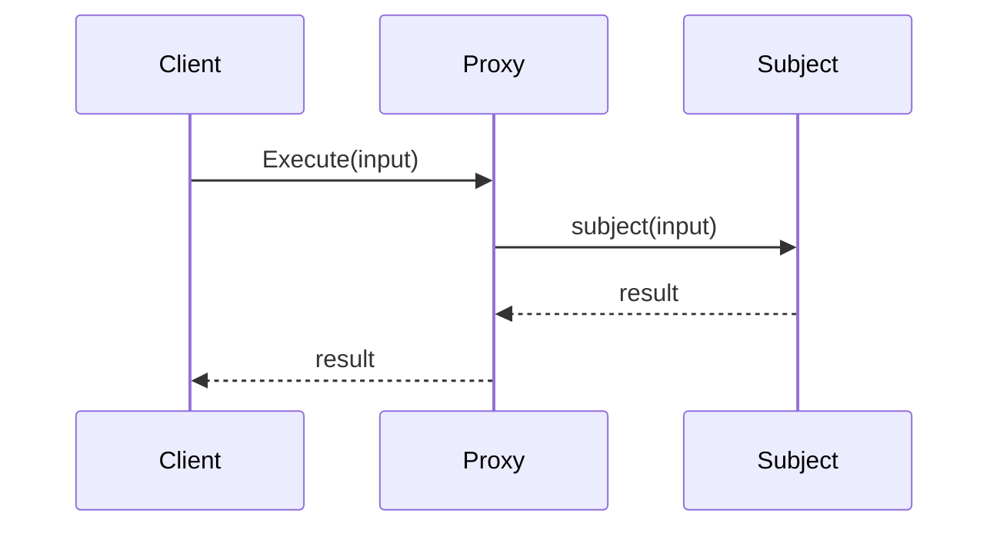
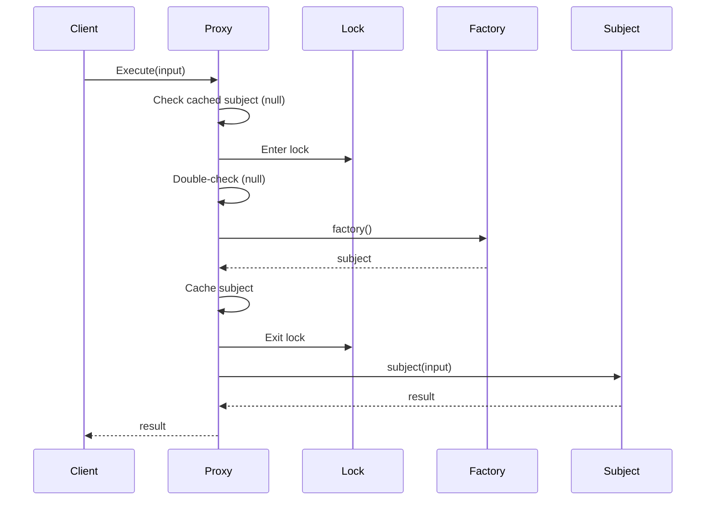
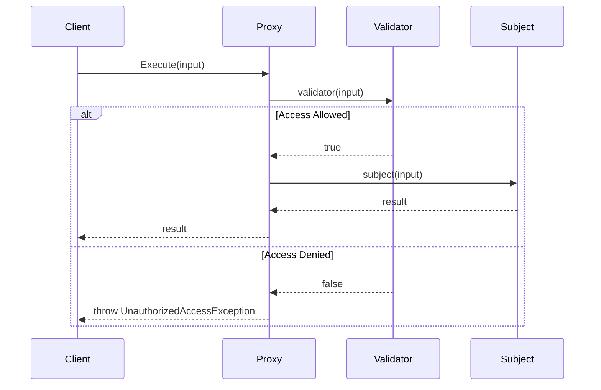
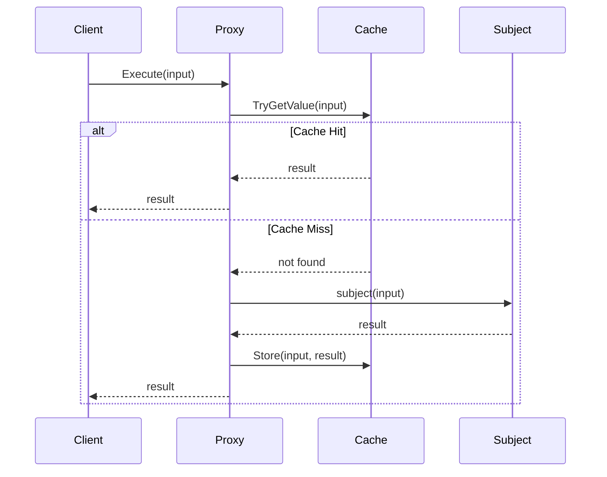

# Proxy Pattern API Reference

Complete API documentation for the Proxy pattern in PatternKit.

## Namespace

```csharp
using PatternKit.Structural.Proxy;
```

---

## Proxy\<TIn, TOut\>

Fluent proxy that controls access to a subject and intercepts invocations.

```csharp
public sealed class Proxy<TIn, TOut> where TIn : notnull
```

### Type Parameters

| Parameter | Constraint | Description |
|-----------|------------|-------------|
| `TIn` | `notnull` | Input type passed to subject |
| `TOut` | none | Output type produced by subject |

### Delegates

```csharp
public delegate TOut Subject(TIn input);
public delegate TOut Interceptor(TIn input, Subject next);
public delegate bool AccessValidator(TIn input);
public delegate Subject SubjectFactory();
```

| Delegate | Description |
|----------|-------------|
| `Subject` | The real operation being proxied |
| `Interceptor` | Full interception with access to next |
| `AccessValidator` | Returns true if access is allowed |
| `SubjectFactory` | Creates subject lazily for virtual proxy |

### Static Methods

| Method | Returns | Description |
|--------|---------|-------------|
| `Create(Subject? subject = null)` | `Builder` | Create builder with optional subject |

### Instance Methods

| Method | Returns | Description |
|--------|---------|-------------|
| `Execute(in TIn input)` | `TOut` | Execute through proxy |

### Example

```csharp
var proxy = Proxy<int, int>.Create(x => x * 2)
    .Before(x => Console.WriteLine($"Input: {x}"))
    .Build();

var result = proxy.Execute(5); // 10
```

---

## Proxy\<TIn, TOut\>.Builder

Builder for configuring proxy behavior.

```csharp
public sealed class Builder
```

### Methods

| Method | Returns | Description |
|--------|---------|-------------|
| `VirtualProxy(SubjectFactory factory)` | `Builder` | Lazy initialization |
| `ProtectionProxy(AccessValidator validator)` | `Builder` | Access control |
| `CachingProxy()` | `Builder` | Memoization with default comparer |
| `CachingProxy(IEqualityComparer<TIn> comparer)` | `Builder` | Memoization with custom comparer |
| `LoggingProxy(Action<string> logger)` | `Builder` | Audit logging |
| `Intercept(Interceptor interceptor)` | `Builder` | Custom interception |
| `Before(Action<TIn> action)` | `Builder` | Pre-execution action |
| `After(Action<TIn, TOut> action)` | `Builder` | Post-execution action |
| `Build()` | `Proxy<TIn, TOut>` | Build immutable proxy |

### Exceptions

| Method | Exception | Condition |
|--------|-----------|-----------|
| All except `VirtualProxy` | `InvalidOperationException` | Subject not provided |
| `Build` | `InvalidOperationException` | Invalid configuration |

---

## ActionProxy\<TIn\>

Proxy for void-returning operations.

```csharp
public sealed class ActionProxy<TIn> where TIn : notnull
```

### Delegates

```csharp
public delegate void Subject(TIn input);
public delegate void Interceptor(TIn input, Subject next);
public delegate bool AccessValidator(TIn input);
public delegate Subject SubjectFactory();
```

### Methods

| Method | Returns | Description |
|--------|---------|-------------|
| `Create(Subject? subject = null)` | `Builder` | Create builder |
| `Execute(in TIn input)` | void | Execute action through proxy |

### Builder Methods

| Method | Returns | Description |
|--------|---------|-------------|
| `VirtualProxy(SubjectFactory factory)` | `Builder` | Lazy initialization |
| `ProtectionProxy(AccessValidator validator)` | `Builder` | Access control |
| `Intercept(Interceptor interceptor)` | `Builder` | Custom interception |
| `Before(Action<TIn> action)` | `Builder` | Pre-execution action |
| `After(Action<TIn> action)` | `Builder` | Post-execution action |
| `Build()` | `ActionProxy<TIn>` | Build proxy |

### Example

```csharp
var proxy = ActionProxy<string>.Create(msg => Console.WriteLine(msg))
    .Before(msg => Console.WriteLine($"[{DateTime.Now}]"))
    .Build();

proxy.Execute("Hello"); // Logs timestamp, then "Hello"
```

---

## AsyncProxy\<TIn, TOut\>

Async proxy for operations returning `ValueTask<TOut>`.

```csharp
public sealed class AsyncProxy<TIn, TOut> where TIn : notnull
```

### Delegates

```csharp
public delegate ValueTask<TOut> Subject(TIn input, CancellationToken ct);
public delegate ValueTask<TOut> Interceptor(TIn input, CancellationToken ct, Subject next);
public delegate ValueTask<bool> AccessValidator(TIn input, CancellationToken ct);
public delegate ValueTask<Subject> SubjectFactory(CancellationToken ct);
public delegate ValueTask BeforeAction(TIn input, CancellationToken ct);
public delegate ValueTask AfterAction(TIn input, TOut result, CancellationToken ct);
```

### Methods

| Method | Returns | Description |
|--------|---------|-------------|
| `Create(Subject? subject = null)` | `Builder` | Create builder |
| `ExecuteAsync(TIn input, CancellationToken ct = default)` | `ValueTask<TOut>` | Execute async |

### Builder Methods

| Method | Returns | Description |
|--------|---------|-------------|
| `VirtualProxy(SubjectFactory factory)` | `Builder` | Async lazy init |
| `VirtualProxy(Func<Subject> factory)` | `Builder` | Sync factory adapter |
| `ProtectionProxy(AccessValidator validator)` | `Builder` | Async access control |
| `ProtectionProxy(Func<TIn, bool> validator)` | `Builder` | Sync validator adapter |
| `Intercept(Interceptor interceptor)` | `Builder` | Custom async interception |
| `Before(BeforeAction action)` | `Builder` | Async pre-action |
| `Before(Action<TIn> action)` | `Builder` | Sync pre-action adapter |
| `After(AfterAction action)` | `Builder` | Async post-action |
| `After(Action<TIn, TOut> action)` | `Builder` | Sync post-action adapter |
| `Build()` | `AsyncProxy<TIn, TOut>` | Build proxy |

### Example

```csharp
var proxy = AsyncProxy<string, HttpResponse>.Create(
        async (url, ct) => await httpClient.GetAsync(url, ct))
    .Before(async (url, ct) => await LogAsync($"Fetching: {url}", ct))
    .Build();

var response = await proxy.ExecuteAsync("https://api.example.com");
```

---

## AsyncActionProxy\<TIn\>

Async proxy for void operations returning `ValueTask`.

```csharp
public sealed class AsyncActionProxy<TIn> where TIn : notnull
```

### Methods

Similar to `AsyncProxy<TIn, TOut>` but for void operations.

### Example

```csharp
var proxy = AsyncActionProxy<Message>.Create(
        async (msg, ct) => await queue.SendAsync(msg, ct))
    .Before(async (msg, ct) => await ValidateAsync(msg, ct))
    .Build();

await proxy.ExecuteAsync(new Message("Hello"));
```

---

## Execution Flow

### Direct Proxy



### Virtual Proxy (First Call)



### Protection Proxy



### Caching Proxy



---

## Thread Safety

| Component | Thread-Safe |
|-----------|-------------|
| `Builder` | No - single-threaded configuration |
| `Proxy<TIn, TOut>` | Yes - immutable after build |
| Virtual proxy init | Yes - double-checked locking |
| Caching proxy cache | No - use ConcurrentDictionary for concurrent access |
| `AsyncProxy` semaphore | Yes - SemaphoreSlim for async init |

### Implementation Notes

- Virtual proxy uses `volatile` + lock for thread-safe lazy init
- Async virtual proxy uses `SemaphoreSlim.WaitAsync`
- Caching uses simple `Dictionary` - not thread-safe for concurrent writes
- All proxies are immutable after `Build()`

---

## Performance Characteristics

| Proxy Type | Latency | Memory |
|------------|---------|--------|
| Direct | ~1-2 ns | Minimal |
| Virtual (after init) | ~3 ns | 1 allocation (subject) |
| Virtual (first call) | ~50-100 ns | Lock overhead |
| Caching (hit) | ~5-10 ns | O(unique inputs) |
| Caching (miss) | subject + ~10 ns | 1 entry |
| Protection | ~2-3 ns | Minimal |
| Logging | ~50 ns | String allocations |

### Benchmarks

```
| Method          | Mean     |
|---------------- |---------:|
| DirectCall      |   1.2 ns |
| DirectProxy     |   2.5 ns |
| VirtualProxy    |   3.1 ns | (after init)
| CachingProxy    |   8.3 ns | (cache hit)
| LoggingProxy    |  45.2 ns | (string alloc)
```

---

## Complete Example

```csharp
using PatternKit.Structural.Proxy;

public class ApiClient
{
    private readonly Proxy<string, ApiResponse> _proxy;

    public ApiClient(HttpClient httpClient, ILogger logger)
    {
        // Layer 1: The actual HTTP call
        Proxy<string, ApiResponse>.Subject makeRequest =
            endpoint => httpClient.GetAsync<ApiResponse>(endpoint);

        // Layer 2: Add retry logic
        var retryProxy = Proxy<string, ApiResponse>.Create(makeRequest)
            .Intercept((endpoint, next) =>
            {
                for (int i = 0; i < 3; i++)
                {
                    try { return next(endpoint); }
                    catch when (i < 2) { Thread.Sleep(100 * (i + 1)); }
                }
                throw new Exception("Max retries");
            })
            .Build();

        // Layer 3: Add caching
        var cachedProxy = Proxy<string, ApiResponse>.Create(
                endpoint => retryProxy.Execute(endpoint))
            .CachingProxy()
            .Build();

        // Layer 4: Add logging
        _proxy = Proxy<string, ApiResponse>.Create(
                endpoint => cachedProxy.Execute(endpoint))
            .LoggingProxy(msg => logger.LogDebug(msg))
            .Build();
    }

    public ApiResponse Get(string endpoint) => _proxy.Execute(endpoint);
}

// Virtual proxy example
public class ExpensiveServiceProxy
{
    private readonly Proxy<Query, Result> _proxy;

    public ExpensiveServiceProxy()
    {
        _proxy = Proxy<Query, Result>.Create()
            .VirtualProxy(() =>
            {
                // Heavy initialization only on first use
                var service = new ExpensiveService();
                service.Initialize(); // 5 second startup
                return query => service.Execute(query);
            })
            .Build();
    }

    public Result Execute(Query query) => _proxy.Execute(query);
}

// Protection proxy example
public class SecureRepository
{
    private readonly Proxy<DeleteCommand, bool> _deleteProxy;

    public SecureRepository(IRepository repo, IAuthService auth)
    {
        _deleteProxy = Proxy<DeleteCommand, bool>.Create(
                cmd => repo.Delete(cmd.EntityId))
            .ProtectionProxy(cmd =>
            {
                var user = auth.GetCurrentUser();
                return user.HasPermission("delete") &&
                       user.CanAccessEntity(cmd.EntityId);
            })
            .Build();
    }

    public bool Delete(DeleteCommand command) => _deleteProxy.Execute(command);
}
```

---

## Comparison with Other Patterns

| Pattern | When to Use |
|---------|-------------|
| **Proxy** | Control access to subject |
| **Decorator** | Enhance functionality |
| **Adapter** | Convert interfaces |
| **Facade** | Simplify complex subsystems |

## See Also

- [Overview](index.md)
- [Comprehensive Guide](guide.md)
- [Real-World Examples](real-world-examples.md)
