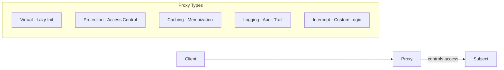

# Proxy Pattern Guide

Comprehensive guide to using the Proxy pattern in PatternKit.

## Overview

Proxy provides a surrogate or placeholder for another object to control access to it. PatternKit's implementation offers fluent, allocation-light proxies with built-in support for common proxy patterns: virtual (lazy), protection, caching, logging, and custom interception.



## Getting Started

### Installation

```csharp
using PatternKit.Structural.Proxy;
```

### Basic Usage

```csharp
// Simple proxy with logging
var proxy = Proxy<int, int>.Create(x => x * 2)
    .Before(x => Console.WriteLine($"Input: {x}"))
    .Build();

var result = proxy.Execute(5); // Logs "Input: 5", returns 10
```

## Core Concepts

### The Subject Delegate

The `Subject` delegate represents the real operation being proxied:

```csharp
public delegate TOut Subject(TIn input);
```

The proxy controls access to this subject through various interception mechanisms.

### Proxy Variants

PatternKit provides four proxy variants:

| Variant | Input | Output | Use Case |
|---------|-------|--------|----------|
| `Proxy<TIn, TOut>` | `TIn` | `TOut` | Sync with return value |
| `ActionProxy<TIn>` | `TIn` | void | Sync side effects |
| `AsyncProxy<TIn, TOut>` | `TIn` | `ValueTask<TOut>` | Async with return value |
| `AsyncActionProxy<TIn>` | `TIn` | `ValueTask` | Async side effects |

## Built-in Proxy Patterns

### Virtual Proxy (Lazy Initialization)

Delays creating expensive objects until first access:

```csharp
var proxy = Proxy<string, Database>.Create()
    .VirtualProxy(() => {
        Console.WriteLine("Creating expensive database connection...");
        return new Database("connection-string");
    })
    .Build();

// Database not created yet
Console.WriteLine("Proxy created");

// NOW the database is initialized
var db = proxy.Execute("query"); // Creates on first call
var db2 = proxy.Execute("query2"); // Reuses cached instance
```

**Thread Safety**: Uses double-checked locking - safe for concurrent access. Factory invoked exactly once.

### Protection Proxy (Access Control)

Validates access before delegating:

```csharp
var deleteProxy = Proxy<DeleteRequest, bool>.Create(req => repository.Delete(req.Id))
    .ProtectionProxy(req => req.User.HasPermission("delete"))
    .Build();

// Throws UnauthorizedAccessException if validation fails
try
{
    deleteProxy.Execute(new DeleteRequest(123, regularUser));
}
catch (UnauthorizedAccessException)
{
    Console.WriteLine("Access denied!");
}

// Admin can proceed
var success = deleteProxy.Execute(new DeleteRequest(123, adminUser));
```

### Caching Proxy (Memoization)

Caches results to avoid redundant operations:

```csharp
var proxy = Proxy<int, int>.Create(n => ExpensiveCalculation(n))
    .CachingProxy()
    .Build();

proxy.Execute(100); // Calculates (slow)
proxy.Execute(100); // Returns cached (instant)
proxy.Execute(100); // Still cached

// With custom comparer for reference types
var stringProxy = Proxy<string, int>.Create(s => s.Length)
    .CachingProxy(StringComparer.OrdinalIgnoreCase)
    .Build();

stringProxy.Execute("HELLO"); // Calculates
stringProxy.Execute("hello"); // Returns cached (case-insensitive)
```

**Note**: Cache never expires. For TTL-based caching, use custom interception.

### Logging Proxy (Audit Trail)

Logs all invocations:

```csharp
var proxy = Proxy<Order, bool>.Create(order => ProcessOrder(order))
    .LoggingProxy(msg => logger.LogInformation(msg))
    .Build();

proxy.Execute(new Order(item: "Widget", qty: 5));
// Logs: "Proxy invoked with input: Order { Item = Widget, Qty = 5 }"
// Logs: "Proxy returned output: True"
```

### Custom Interception

Full control over execution:

```csharp
var retryProxy = Proxy<string, string>.Create(request => UnreliableService(request))
    .Intercept((input, next) =>
    {
        for (int i = 0; i < 3; i++)
        {
            try
            {
                return next(input);
            }
            catch (Exception) when (i < 2)
            {
                Thread.Sleep(1000 * (i + 1)); // Exponential backoff
            }
        }
        throw new Exception("Max retries exceeded");
    })
    .Build();
```

**Interceptor Capabilities**:
- Modify input before calling subject
- Skip calling subject entirely (short-circuit)
- Modify output before returning
- Add error handling, retry logic, circuit breakers
- Measure execution time
- Implement custom caching strategies

### Before/After Actions

Simple side effects without modifying values:

```csharp
var proxy = Proxy<int, int>.Create(x => x * 2)
    .Before(x => Console.WriteLine($"Processing: {x}"))
    .After((x, result) => Console.WriteLine($"Result: {result}"))
    .Build();
```

## Async Proxies

For async operations, use `AsyncProxy` or `AsyncActionProxy`:

```csharp
var asyncProxy = AsyncProxy<string, HttpResponse>.Create(
        async (url, ct) => await httpClient.GetAsync(url, ct))
    .Before(async (url, ct) => await LogRequestAsync(url, ct))
    .After(async (url, response, ct) => await LogResponseAsync(response, ct))
    .Build();

var response = await asyncProxy.ExecuteAsync("https://api.example.com/data");
```

### Async Virtual Proxy

```csharp
var proxy = AsyncProxy<Query, Result>.Create()
    .VirtualProxy(async ct =>
    {
        var connection = await OpenConnectionAsync(ct);
        return (Query q, CancellationToken c) => connection.ExecuteAsync(q, c);
    })
    .Build();
```

### Async Protection Proxy

```csharp
var proxy = AsyncProxy<Request, Response>.Create(ProcessAsync)
    .ProtectionProxy(async (req, ct) =>
    {
        var permissions = await authService.GetPermissionsAsync(req.UserId, ct);
        return permissions.Contains("admin");
    })
    .Build();
```

## Common Patterns

### Retry with Circuit Breaker

```csharp
public class CircuitBreakerProxy<TIn, TOut> where TIn : notnull
{
    private readonly Proxy<TIn, TOut> _proxy;
    private int _failureCount;
    private DateTime _circuitOpenedAt;
    private readonly int _threshold;
    private readonly TimeSpan _resetTimeout;
    private readonly object _lock = new();

    public CircuitBreakerProxy(
        Proxy<TIn, TOut>.Subject subject,
        int threshold = 5,
        TimeSpan? resetTimeout = null)
    {
        _threshold = threshold;
        _resetTimeout = resetTimeout ?? TimeSpan.FromSeconds(30);

        _proxy = Proxy<TIn, TOut>.Create(subject)
            .Intercept((input, next) =>
            {
                // Check circuit state
                lock (_lock)
                {
                    if (_failureCount >= _threshold)
                    {
                        if (DateTime.UtcNow - _circuitOpenedAt < _resetTimeout)
                            throw new CircuitBreakerOpenException();
                        _failureCount = 0; // Half-open: try again
                    }
                }

                try
                {
                    var result = next(input);
                    lock (_lock) _failureCount = 0; // Success resets
                    return result;
                }
                catch
                {
                    lock (_lock)
                    {
                        _failureCount++;
                        if (_failureCount >= _threshold)
                            _circuitOpenedAt = DateTime.UtcNow;
                    }
                    throw;
                }
            })
            .Build();
    }

    public TOut Execute(TIn input) => _proxy.Execute(input);
}
```

### Timing/Metrics Proxy

```csharp
var metricsProxy = Proxy<Request, Response>.Create(ProcessRequest)
    .Intercept((req, next) =>
    {
        var sw = Stopwatch.StartNew();
        try
        {
            var result = next(req);
            metrics.RecordSuccess("request", sw.ElapsedMilliseconds);
            return result;
        }
        catch (Exception ex)
        {
            metrics.RecordFailure("request", sw.ElapsedMilliseconds, ex.GetType().Name);
            throw;
        }
    })
    .Build();
```

### Rate Limiting Proxy

```csharp
public class RateLimitingProxy<TIn, TOut> where TIn : notnull
{
    private readonly Proxy<TIn, TOut> _proxy;
    private readonly SemaphoreSlim _semaphore;
    private readonly Queue<DateTime> _requestTimes = new();
    private readonly int _maxRequests;
    private readonly TimeSpan _window;

    public RateLimitingProxy(
        Proxy<TIn, TOut>.Subject subject,
        int maxRequests,
        TimeSpan window)
    {
        _maxRequests = maxRequests;
        _window = window;
        _semaphore = new SemaphoreSlim(1, 1);

        _proxy = Proxy<TIn, TOut>.Create(subject)
            .Intercept((input, next) =>
            {
                _semaphore.Wait();
                try
                {
                    // Clean old entries
                    var cutoff = DateTime.UtcNow - _window;
                    while (_requestTimes.Count > 0 && _requestTimes.Peek() < cutoff)
                        _requestTimes.Dequeue();

                    // Check rate limit
                    if (_requestTimes.Count >= _maxRequests)
                        throw new RateLimitExceededException(
                            $"Rate limit of {_maxRequests} per {_window} exceeded");

                    _requestTimes.Enqueue(DateTime.UtcNow);
                }
                finally
                {
                    _semaphore.Release();
                }

                return next(input);
            })
            .Build();
    }

    public TOut Execute(TIn input) => _proxy.Execute(input);
}
```

### Composing Multiple Proxies

Layer proxies for complex scenarios:

```csharp
// Layer 1: Retry logic
var retryProxy = Proxy<string, string>.Create(CallApi)
    .Intercept(RetryInterceptor)
    .Build();

// Layer 2: Caching
var cachedProxy = Proxy<string, string>.Create(
        req => retryProxy.Execute(req))
    .CachingProxy()
    .Build();

// Layer 3: Logging
var fullProxy = Proxy<string, string>.Create(
        req => cachedProxy.Execute(req))
    .LoggingProxy(logger.Log)
    .Build();

// Execution order: Log → Cache check → (Retry → API) if cache miss
```

## Proxy vs Decorator

| Aspect | Proxy | Decorator |
|--------|-------|-----------|
| **Intent** | Control **access** | **Enhance** functionality |
| **Subject** | May not exist yet (virtual) | Must exist at construction |
| **Delegation** | May skip entirely | Always calls wrapped component |
| **Use case** | Lazy loading, security, caching | Add logging, validation, formatting |

**Rule of thumb**: If asking "Should I call the real object?", use Proxy. If asking "How should I enhance the result?", use Decorator.

## Thread Safety

| Component | Thread-Safe |
|-----------|-------------|
| `Builder` | No - single-threaded configuration |
| `Proxy<TIn, TOut>` | Yes - immutable after build |
| Virtual proxy init | Yes - double-checked locking |
| Caching proxy | No - needs external synchronization for thread-safe cache |

**Note**: While the proxy itself is thread-safe, the caching proxy's internal dictionary is not thread-safe for concurrent writes. For concurrent scenarios, use `Intercept` with `ConcurrentDictionary`.

## Performance Characteristics

| Proxy Type | Overhead |
|------------|----------|
| Direct | ~1-2 ns (delegate call) |
| Virtual | ~3 ns (after init) |
| Caching | ~5-10 ns (dictionary lookup) |
| Protection | ~2-3 ns (predicate check) |
| Logging | ~50 ns (string allocation) |

### Memory

- Virtual proxy: One allocation for factory + cached subject
- Caching proxy: O(n) where n = unique inputs
- Other proxies: Minimal (one object + delegates)

## Best Practices

### Do

- Use virtual proxies for expensive initialization
- Cache immutable or stable data
- Combine proxies for complex scenarios
- Use protection proxies at boundaries
- Build once, reuse many times

### Don't

- Cache mutable objects (stale data)
- Use caching without understanding equality
- Create proxies in hot paths (create once)
- Mix responsibilities (use decorator for enhancement)
- Forget cache never expires (use custom interceptor for TTL)

## See Also

- [Overview](index.md)
- [API Reference](api-reference.md)
- [Real-World Examples](real-world-examples.md)
